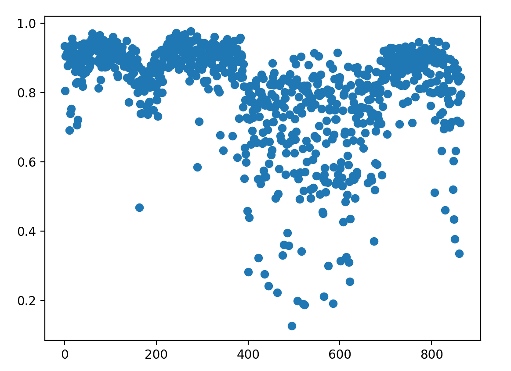

# Improved UNet arcitecture for Image segmentation of the ISIC2018 dataset
## Recognition task
The purpose of the recognition task is to perform image segmentation on the ISIC 2018 dataset. 
For testing on the test set, an average *DSC*[^1] of 0.8 is expected.

[^1]: https://en.wikipedia.org/wiki/S%C3%B8rensen%E2%80%93Dice\_coefficient 
## Dataset
The ISIC 2018 dataset was published by the International Skin Imaging Collaboration (ISIC) as
a large-scale dataset of dermoscopy images. This Task 1 dataset is the challenge on lesion segmentation.
It includes 2594 images.[^2]

[^2]: https://arxiv.org/abs/1909.00166
## Model arcitecture
The classic ***UNet*** arcitecture is a deep learning arcitecture primarily used in semantic image segmentation
which goal is to classify each pixel of a image into a class or object[^3].
The arcitecture consists of three parts. The encoder, bottleneck and Decoder. The encoder consists of multiple
convolutional layers and downsampling operations, and is responsible for capturing features of the image.
The bottleneck is the bottom layer of the network, and also consist of multiple convolutional layers.
The decoder upsamples the feature maps to generate a segmentation mask with the same dimensions as the input.
UNet arcitectures also uses skip connections in each layer of the network to help preserve detailed information of the image. 
The skip connections are combined together with the features learned from the encoder on each layer.

This UNet model is employed according to [^4] with changes made to acommodate for use on the ISIC2018 dataset. \
This includes changing 3d modules to 2d, and returning the output through a sigmoid function instead of softmax. \
The model uses deep supervision wich helps mitigate the vanishing gradient problem. It does this by integrating
intermediate loss signals into the output. This allows for more efficient flow of gradients during backpropegation. \
As with general UNet arcitecture; skip connections are also used for their ability to improve segmentation quality. 

The convolution and context layers in the encoder allows for more feature extraction during downsizing.
The upsampling block upsamples the low resolution feature maps, 
After concatination of the upsampled features and the skip connection the loacaliztion module recombines these features together.

### input/output
The network takes a RGB channeled image as input, and outputs a binary segmentation map.


[^3]: https://paperswithcode.com/task/semantic-segmentation
[^4]: https://arxiv.org/abs/1802.10508v1

## dataset creation
The image sizes in the dataset varey. This causes problems when loading the data from the pytorch dataloader.
As a work around fo this issue a standard image size can be specified in the macro *IMAGE_SIZE* in ***dataset.py*** .
The path of the dataset should be specified in the following macros in ***dataset.py***:
```
TRAIN_DATA_PATH = "Path/to/your/dataset"
TRAIN_TRUTH_PATH = "Path/to/your/dataset"
TEST_TRUTH_PATH = "Path/to/your/dataset"
TEST_TRAIN_PATH = "Path/to/your/dataset"
```
While training on the computing cluster[^5] the test dataset had no corresponding groundtruth images. 
As a work around for this The *ISICDataset* class in ***dataset.py*** can be specified with a split ratio as well as a boolean train statement. 
This allows the user to specify wich part of the directory he/she wishes 
to use for both training and testing.

example:
```
train_data = ISICDataset(img_dir=TRAIN_DATA_PATH, truth_dir=TRAIN_TRUTH_PATH ,split_ratio=0.9, transform=transform, train=True)
val_data = ISICDataset(img_dir=TRAIN_DATA_PATH, truth_dir=TRAIN_TRUTH_PATH, split_ratio=0.9,transform=transform, train=False)
```

In this example the train data will be allocated the first 90% of the directory,
and the valuation data will be allocated the last 10%.

# Preproccesing
The ISIC 2018 training dataset consists of 2594 images. to push the algorithm to train on more complex data,
Image augmentation is included when loading the dataset. The image augmentation consists of random rotation and image flipping.
This allows the network to train on a more diverse data.

## Training
The Network was trained with an initial learning rate of *5e-4* and a linear step scheduler with stepsize of 4 and
a gamma value of 0.985. The network trained for 60 epochs. Due to high traffic on the computing cluster[^5] the images was rezised to
64 x 64 pixels to allow for training on the cpu on a computer.

[^5]: https://rcc.uq.edu.au/high-performance-computing
## example segmentation


## loss function
The dice loss function is used during training on this dataset.
The dice loss is the inverse of the dice coefficent which checks 
for pixel-wise agreement between a predicted segmentation and its groundtruth. 
a small dice loss will therefore correspond with a good segmentation.
While training the network seemed to give lower priority to segmentations with low dice scores.
To fix this issue a smoothing parameter was added. This parameter allows for more control of
sensitivity between small differences between the prediction and target. This seemed to refocuse the network on
improving the segmentations with the worst dice scores.
The code for this custom loss function is gotten from [Dice Loss Class](https://www.kaggle.com/code/bigironsphere/loss-function-library-keras-pytorch?fbclid=IwAR3q7bjIDoKFlc5IDGpd24TW8QhQdzbxh2TrIP6FCXb7A8FaluU_HhTqmHA). \
code:
```
class DiceLoss(nn.Module):
    def __init__(self, smooth=1.0):
        super(DiceLoss, self).__init__()
        self.smooth = smooth

    def forward(self, predict, target):
        predict = predict.view(-1)
        target = target.view(-1)

        intersect = (predict * target).sum()
        dice = (2*intersect + self.smooth)/(predict.sum() + target.sum() + self.smooth)
        return 1 - dice
```

## Final product
The model achieves a average dice score of 0.8 with each individual dice score being represented in the plot below.
Further improvements of the training should be tested to improve the minimum dice scores for the set.



## dependencies
* pytorch (2.1.0) for dataset creation, data loading and torchvision functionality and training
* pillow (10.0.1) for image loading
* matplotlib (3.7.2) for plotting
* numpy (1.24.3) for plotting

## References
[1] Noel Codella, Veronica Rotemberg, Philipp Tschandl, M. Emre Celebi, Stephen Dusza, David Gutman, Brian Helba, Aadi Kalloo, Konstantinos Liopyris, Michael Marchetti, Harald Kittler, Allan Halpern: "Skin Lesion Analysis Toward Melanoma Detection 2018: A Challenge Hosted by the International Skin Imaging Collaboration (ISIC)", 2018; https://arxiv.org/abs/1902.03368

[2] Tschandl, P., Rosendahl, C. & Kittler, H. The HAM10000 dataset, a large collection of multi-source dermatoscopic images of common pigmented skin lesions. Sci. Data 5, 180161 doi:10.1038/sdata.2018.161 (2018).

[3] Name not known, , \[RNA\](2021) 'Loss function Library - Keras & PyTorch'. kaggle.com
    12, October. Available at: https://www.kaggle.com/code/bigironsphere/loss-function-library-keras-pytorch?fbclid=IwAR3q7bjIDoKFlc5IDGpd24TW8QhQdzbxh2TrIP6FCXb7A8FaluU_HhTqmHA 
