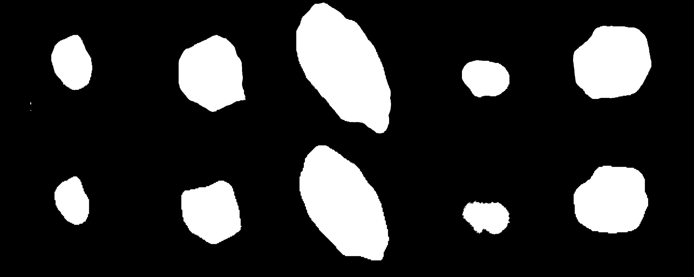

# Binary Segmentation of ISIC2018 with improved uNet model
Author: Marius Saether

Student nr: 48242099

## Overview
Project for segmentation of the ISIC 2018/8 dataset, using the improved UNet architecture and aiming for a minimum DSC of 0.8. The module used in this project is based on the works of Isensee, Et al. in their 2018 paper: Brain Tumor Segmentation and Radiomics Survival Prediction: Contribution to the BRATS 2017 Challenge[^1]. 

The model scores an average DCS of 0.834 on the validation set, but struggles with almost no overlap on selected images

## Task
The task of segmenting the ISIC 2018 dataset is done by the model classifying each pixel of the images. The pixels are classified as either as a lesion, or not a lesion. During the training of the model, each segmentet image is compared to a ground truth image through a loss function, feeding the result back to the model. Over time the model will then learn to classify areas of a dermoscopy.    

## Model Architecture

_image copied from [^1]_

The model is based on the standard uNet structure. The encoder gradually reduces the spacial information, and increases the feature information down to the bottleneck. In this model this is done through 3x3 convolutions and context modules, which halves the space, and doubles the features at each layer. These different representations of the image is accesable for the encoder through pathways implemented at each layer. The encoder combines the output of these pathways with an upscaled representation of the lower level encoded features. This is done all the way to the final layer, where the output will have the same dimentions as the ground truth image it is compaired against.

Where this model differs from the traditional uNet structure is the implementation of segmentation layers. The output of the 2. and the 3. encoded layer is each passed trough a convolution, making them the same dimentions as the output-layer. These are then added together, before the sum is added to the output-layer. The goal of this is for the output to contain a combination of information extracted at each layer.  

Compared to the model presented in [^1], this implementation is modified for binary segmentation of 2d images. It therefore uses the Sigmoid function inplace of the Softmax, and 2-dimentional convolutions.

## Pre-prosessing of data
The ISIC2018 dataset contains 2594 dermoscopy images with a corresponding ground truth. It also contains 100 separate validation images with corresponding ground truth, which is used to assess the performance after the model is trained. The dataset is split into training and test (80% of data / 20% of data), using the functions 'data_sorter', which splits the input into lists of paths, and the class 'customDataset', which creates the actual datasets. This is implemented to apply different transformations to each set, without having to manualy split the data before running the program.  

The images have large variations in size, so they are rezised to 512*512. The custom transformation class 'train_Transformation' is used to support transformations with a random component. When it occurs it will act similarly on both the training image and the corresponding ground truth. 
The transformation used on the training-set is: random horisontal- and verticalflip, random rotation, and random adjustment of brightness, contrast and saturation. 

The various transformations was aimed to increase the dice score of the poorly segmented outliers in the test, but failed to do so. They did however increase the average DCS score.

## Training and parameters

The model was trained using the Adam optimizer with a learning rate of 0.0005 and a step-learning rate scheduler which decreases the learning rate by 0.985 every epoch. The model trained for 100 epochs, with a batch size of 6, and was evaluated against the test set after every epoch. The model parameters was saved each time the test outperformed previous results, innsuring that the best model was stored at the end of the training proccess.  

The loss function is implemented as a dice loss, given by 1 - the DCS between model output and corresponing ground truth. The aim is for the model to continously decrease the dice loss during training, and thus increasing the DCS. 

## Results
The models performance on the validation set, after being trained. These 100 images has not been given to the model up until this point.  

_Top layer shows a sample of validation images, the middle layer is the segmentet output of the trained model, bottom layer shows corresponding grount truth_

### Dice scores on the validation set

* Average score: 0.834

* Min score: 0.004

77% of the validation samples are within the target score of <0.8, while 2 outliers are below 0.01.

## Improvements
The main problem with the model as it stands is the minimum dice score when the test set is sent through the trained model. Even though the model scores an average DCS of 0.834, the worst 2 segmentation scores below 0.01, meaning practically no overlap with the ground truth. 

## Dependencies
Pytorch: 2.0.1

cuda: 11.7

python: 3.10.12

scikit-learn: 1.3.0

pillow: 9.4.0

matplotlib: 3.7.1

## References
[^1]: https://arxiv.org/pdf/1802.10508v1.pdf
* [1] F. Isensee, P. Kickingereder, W. Wick, M. Bendszus, and K. H. Maier-Hein, “Brain Tumor Segmentation
and Radiomics Survival Prediction: Contribution to the BRATS 2017 Challenge,” Feb. 2018. [Online].
Available: https://arxiv.org/abs/1802.10508v1

